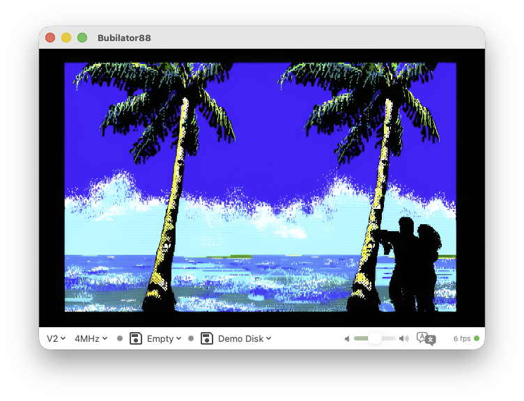

# Bubilator88

<p align="center">
  
</p>

NEC PC-8801 エミュレーター for macOS

<p align="center">
  <a href="https://github.com/bubio/Bubilator88/releases/latest">
    
  </a>
  <a href="https://github.com/bubio/Bubilator88/blob/main/LICENSE">
    
  </a>
  <a href="https://github.com/bubio/Bubilator88/releases/latest">
    
  </a>
</p>

## About

Bubilator88 は、NEC パーソナルコンピュータ PC-8801 の macOS ネイティブエミュレーターです。

**このプロジェクトのコードは、ほぼすべて AI（Claude, Codex）によって書かれています。**

<p align="center">
  
</p>


レトロ PC エミュレーターは、未文書化されたハードウェアの挙動再現、T ステート精度のタイミング制御、複数 LSI の協調動作など、深い専門知識と緻密な実装を要求される特殊なソフトウェアです。「AI はこの種のソフトウェアをゼロから構築できるのか？」— の興味から開発しました。

macOSらしいUIと機能を追求しています。

## Features

- Z80 CPU エミュレーション（T ステート精度）
- YM2608 (OPNA) サウンド — FM 6ch、SSG 3ch、リズム、ADPCM
- uPD765A FDC
- uPD3301 CRTC + DMA テキスト表示
- Metal による高速な画面描画
- AVAudioEngine による低遅延サウンド出力
- ゲームコントローラー対応（ハプティックフィードバック）
- Apple Silicon ネイティブ

### 画面フィルター

Metal シェーダーによる複数の画面フィルターを搭載しています。

- **Linear / Bicubic** — バイリニア・バイキュービック補間によるスムージング
- **CRT** — CRT モニターのスキャンライン・蛍光体残光を再現
- **xBRZ** — ピクセルアートに特化したエッジ検出スケーラ
- **Enhanced** — xBRZ + 独自フィルタの組み合わせ
### AI Upscale

CoreML 上で超解像モデルを実行し、640x200 / 640x400 のピクセルアートをリアルタイムにアップスケーリングします。Apple Silicon の Neural Engine を活用し、エッジやディテールを保持したまま高解像度化します。M4 Pro以上の性能がないと実用は難しいと思います。

3 つのモデルを搭載しています:

- **AI Upscale (Fast)** — SRVGGNet (32ch × 12層、約 11.6万パラメータ) の軽量モデル。Balanced と同じパイプラインでさらに小型化したもので、リアルタイム処理を最優先する場合に使用します。
- **AI Upscale (Balanced)** — SRVGGNet (64ch × 16層、約 60万パラメータ)。PC-8801 画面に特化した知識蒸留モデルで、Real-ESRGAN の出力を正解データとして学習。画質と速度のバランスが取れた標準モードです。
- **AI Upscale (Quality)** — Real-ESRGAN (RRDBNet)。高品質だが重い、リファレンス品質。スクリーンショットや静的画面に向きます。

### イマーシブオーディオ

AirPodsなどのヘッドトラッキングと連動した空間オーディオを実現します。FM、SSG、リズム、ADPCM の各チャンネルを 3D 空間上に自由に配置でき、頭の動きに追従してサウンドが変化します。

### 疑似ステレオ

モノラル出力のサウンドに左右の微小なディレイ差を加え、擬似的なステレオ広がりを生成します。

### リアルタイム翻訳オーバーレイ

Apple Vision OCR + Translation フレームワークを使い、画面上の日本語テキストをリアルタイムで認識・翻訳してオーバーレイ表示します。

### ハプティックフィードバック

ゲームコントローラーの振動機能に対応。SSGによる効果音に連動した触覚フィードバックを提供します。

### テキストのコピー＆ペースト

エミュレータの画面テキストを macOS のクリップボードへコピー、またはクリップボードのテキストを擬似キー入力として流し込むことができます。半角カナを含む BASIC プログラムのリスト転記や、サンプルコードの貼り付けが手打ちなしで行えます。

## System Requirements

- macOS 26.0 (Tahoe) 以降
- Apple Silicon Mac

## Install

[Releases](https://github.com/bubio/Bubilator88/releases)ページから最新版をダウンロードしてください。

> **注意**: このアプリは Apple によるノータリゼーション（公証）を受けていないため、初回起動時に Gatekeeper によってブロックされる場合があります。以下のいずれかの方法で回避できます：
>
> **方法1: ターミナルで隔離フラグを削除**
> ```bash
> xattr -cr /Applications/Bubilator88.app
> ```
>
> **方法2: システム設定から許可**
> 1. アプリを開こうとしてブロックされた後
> 2. 「システム設定」→「プライバシーとセキュリティ」を開く
> 3. 「"Bubilator88"は開発元を確認できないため、使用がブロックされました」の横にある「このまま開く」をクリック

## ROM Files

PC-8801 の起動には実機の ROM ファイルおよびリズム音源用 WAV ファイルが必要です（本プロジェクトには含まれていません）。

*~/Library/Application Support/Bubilator88/* に配置してください。

```
~/Library/Application Support/Bubilator88/
├── N88.ROM          N88-BASIC ROM（必須）
├── N80.ROM          N-BASIC ROM
├── FONT.ROM         フォント ROM
├── KANJI1.ROM       漢字 ROM（第1水準）
├── KANJI2.ROM       漢字 ROM（第2水準）
├── DISK.ROM         サブ CPU ファームウェア（8KB）
├── N88_0.ROM        N88 拡張 ROM バンク 0
├── N88_1.ROM        N88 拡張 ROM バンク 1
├── N88_2.ROM        N88 拡張 ROM バンク 2
├── N88_3.ROM        N88 拡張 ROM バンク 3
├── 2608_BD.WAV      YM2608 リズム音源（バスドラム）
├── 2608_SD.WAV      YM2608 リズム音源（スネア）
├── 2608_TOP.WAV     YM2608 リズム音源（シンバル）
├── 2608_HH.WAV      YM2608 リズム音源（ハイハット）
├── 2608_TOM.WAV     YM2608 リズム音源（タム）
└── 2608_RIM.WAV     YM2608 リズム音源（リムショット）
```

## Credits

- **FM 合成エンジン**: [fmgen](http://retropc.net/cisc/sound/) by cisc — Swift への移植
- **参考エミュレーター**: [QUASI88](https://www.eonet.ne.jp/~showtime/quasi88/) by S.Fukunaga — ビヘイビアリファレンスとして参照
- **参考エミュレーター**: [common source code project](https://takeda-toshiya.my.coocan.jp/common/index.html) by Takeda Toshiya — BubiC-8801MA として参照
- **参考エミュレーター**: [X88000](https://quagma.sakura.ne.jp/manuke/x88000.html) by Manuke — Z80 未文書化命令や細部の実装リファレンスとして参照
- **技術資料**: [PC-8801についてのページ](http://www.maroon.dti.ne.jp/youkan/pc88/) by youkan — ハードウェア仕様リファレンス
- **技術資料**: [PC-8801 VRAM情報](http://mydocuments.g2.xrea.com/html/p8/vraminfo.html) — VRAM アクセス仕様リファレンス
- **スケーリングアルゴリズム**: [xBRZ](https://sourceforge.net/projects/xbrz/) by Zenju — Enhanced フィルターのベース
- **AI モデル**: [Real-ESRGAN](https://github.com/xinntao/Real-ESRGAN) — 超解像アップスケーリング用 CoreML モデル
- **AI コーディング**: [Claude Code](https://claude.ai/code) (Anthropic) — コードのほぼ全体を生成

## License

[GNU General Public License v2.0](LICENSE)
