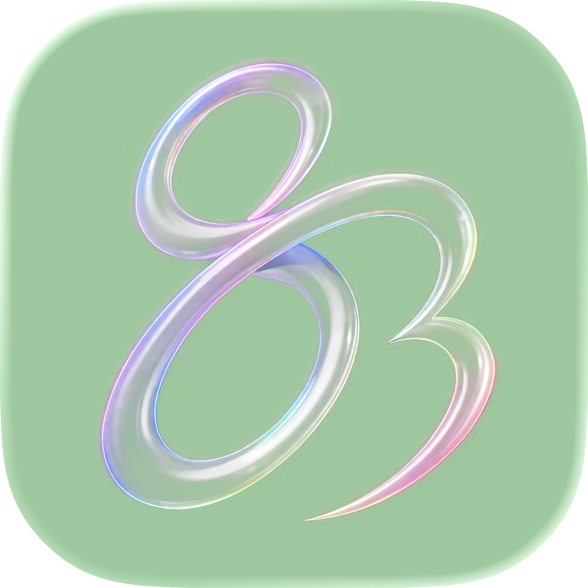
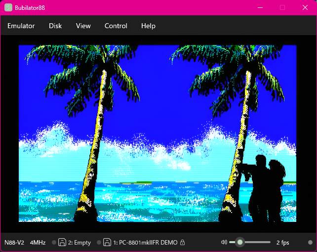

# Bubilator88

<p align="center">
  
</p>

NEC PC-8801 エミュレーター for Windows(実験的移植版)

[](https://github.com/bubio/Bubilator88/releases/latest)
[](https://github.com/bubio/Bubilator88/blob/main/LICENSE)
[](https://github.com/bubio/Bubilator88/releases/latest)
[](https://github.com/bubio/Bubilator88/actions/workflows/codeql.yml)

> ⚠️ **実験的な移植版です**: Bubilator88 は元々 macOS ネイティブアプリとして開発されました。
> このブランチは、Swift で書かれたエミュレーションコア (EmulatorCore) が macOS 以外の
> OS でも本当に正しく動作するのかを検証するための実験的な Windows ネイティブ移植です。
> コア (Z80 / YM2608 / uPD765A FDC / uPD3301 CRTC 等) は一切書き直さず、Swift toolchain
> for Windows でそのままネイティブ DLL 化し、C# + WinUI 3 のシェルから P/Invoke で駆動して
> います。760 以上のユニットテストが Windows 上でも macOS と同一の結果でパスすることを確認済み
> ですが、macOS 版ほど実運用で枯れてはいない点にご留意ください。詳細は `docs/WINDOWS_PORT.md` を参照。

## About

Bubilator88 は、NEC パーソナルコンピュータ PC-8801 のエミュレーターです。

**このプロジェクトのコードは、ほぼすべて AI(Claude, Codex)によって書かれています。**

<p align="center">
  
</p>


レトロ PC エミュレーターは、未文書化されたハードウェアの挙動再現、T ステート精度のタイミング制御、複数 LSI の協調動作など、深い専門知識と緻密な実装を要求される特殊なソフトウェアです。「AI はこの種のソフトウェアをゼロから構築できるのか？」— の興味から開発しました。

Windows 版は、その同じ Swift 製コアを土台に、Windows ネイティブな UI (WinUI 3) と D3D11 / XAudio2 による描画・音声を追求しています。

## Features

- Z80 CPU エミュレーション(T ステート精度)
- YM2608 (OPNA) サウンド — FM 6ch、SSG 3ch、リズム、ADPCM
- uPD765A FDC
- uPD3301 CRTC + DMA テキスト表示
- Direct3D 11 による高速な画面描画
- XAudio2 による低遅延サウンド出力
- ゲームコントローラー対応(`Windows.Gaming.Input.Gamepad`。振動フィードバックは未対応、下記参照)
- Windows 11　x64 ネイティブ

### 画面フィルター

Direct3D 11 シェーダーによる複数の画面フィルターを搭載しています。

- **Linear / Bicubic** — バイリニア・バイキュービック補間によるスムージング
- **CRT** — CRT モニターのスキャンライン・蛍光体残光を再現
- **xBRZ** — ピクセルアートに特化したエッジ検出スケーラ
- **Enhanced** — xBRZ + 独自フィルタの組み合わせ

### AI Upscale

ONNX Runtime + DirectML 上で超解像モデルを実行し、640x200 / 640x400 のピクセルアートをリアルタイムにアップスケーリングします。DirectX 12 対応 GPU を活用し、エッジやディテールを保持したまま高解像度化します。ある程度性能のある dGPU がないと実用は難しいと思います。

3 つのモデルを搭載しています:

- **AI Upscale (Fast)** — SRVGGNet (32ch × 12層、約 11.6万パラメータ) の軽量モデル。Balanced と同じパイプラインでさらに小型化したもので、リアルタイム処理を最優先する場合に使用します。
- **AI Upscale (Balanced)** — SRVGGNet (64ch × 16層、約 60万パラメータ)。PC-8801 画面に特化した知識蒸留モデルで、Real-ESRGAN の出力を正解データとして学習。画質と速度のバランスが取れた標準モードです。
- **AI Upscale (Quality)** — Real-ESRGAN (RRDBNet)。高品質だが重い、リファレンス品質。スクリーンショットや静的画面に向きます。


### 疑似ステレオ

モノラル出力のサウンドに左右の微小なディレイ差を加え、擬似的なステレオ広がりを生成します。

## System Requirements

- Windows 11、x64
- ある程度の性能の GPU(AI Upscale フィルタを使う場合。DirectX 12 対応推奨)

## Install

### 手動ダウンロード

[Releases](https://github.com/bubio/Bubilator88/releases)ページから `win-v*` タグの最新版(zip)をダウンロードし、任意のフォルダに展開して `Bubilator88.Windows.exe` を実行してください。.NET やその他ランタイムの個別インストールは不要です(自己完結型で配布)。

> **注意**: この exe は Microsoft によるコード署名を受けていないため、初回起動時に
> Windows SmartScreen によってブロックされる場合があります。「詳細情報」→「実行」で
> 起動できます。

## ROM Files

PC-8801 の起動には実機の ROM ファイルおよびリズム音源用 WAV ファイルが必要です(本プロジェクトには含まれていません)。

*%LOCALAPPDATA%\Bubilator88\* に配置してください。

```
%LOCALAPPDATA%\Bubilator88\
├── N88.ROM          N88-BASIC ROM(必須)
├── N80.ROM          N-BASIC ROM
├── FONT.ROM         フォント ROM
├── KANJI1.ROM       漢字 ROM(第1水準)
├── KANJI2.ROM       漢字 ROM(第2水準)
├── DISK.ROM         サブ CPU ファームウェア(8KB)
├── N88_0.ROM        N88 拡張 ROM バンク 0
├── N88_1.ROM        N88 拡張 ROM バンク 1
├── N88_2.ROM        N88 拡張 ROM バンク 2
├── N88_3.ROM        N88 拡張 ROM バンク 3
├── 2608_BD.WAV      YM2608 リズム音源(バスドラム)
├── 2608_SD.WAV      YM2608 リズム音源(スネア)
├── 2608_TOP.WAV     YM2608 リズム音源(シンバル)
├── 2608_HH.WAV      YM2608 リズム音源(ハイハット)
├── 2608_TOM.WAV     YM2608 リズム音源(タム)
└── 2608_RIM.WAV     YM2608 リズム音源(リムショット)
```

## Credits

- **FM 合成エンジン**: [fmgen](http://retropc.net/cisc/sound/) by cisc — Swift への移植
- **参考エミュレーター**: [QUASI88](https://www.eonet.ne.jp/~showtime/quasi88/) by S.Fukunaga — ビヘイビアリファレンスとして参照
- **参考エミュレーター**: [common source code project](https://takeda-toshiya.my.coocan.jp/common/index.html) by Takeda Toshiya — BubiC-8801MA として参照
- **参考エミュレーター**: [X88000](https://quagma.sakura.ne.jp/manuke/x88000.html) by Manuke — Z80 未文書化命令や細部の実装リファレンスとして参照
- **技術資料**: [PC-8801についてのページ](http://www.maroon.dti.ne.jp/youkan/pc88/) by youkan — ハードウェア仕様リファレンス
- **技術資料**: [PC-8801 VRAM情報](http://mydocuments.g2.xrea.com/html/p8/vraminfo.html) — VRAM アクセス仕様リファレンス
- **スケーリングアルゴリズム**: [xBRZ](https://sourceforge.net/projects/xbrz/) by Zenju — Enhanced フィルターのベース
- **AI モデル**: [Real-ESRGAN](https://github.com/xinntao/Real-ESRGAN) — 超解像アップスケーリング用モデル(ONNX 形式で実行)
- **Windows 移植**: Windows App SDK (WinUI 3) / [Vortice.Windows](https://github.com/amerkoleci/Vortice.Windows)(Direct3D 11 / XAudio2 バインディング) / ONNX Runtime + DirectML
- **AI コーディング**: [Claude Code](https://claude.ai/code) (Anthropic) — コードのほぼ全体を生成

## License

[GNU General Public License v2.0](LICENSE)
